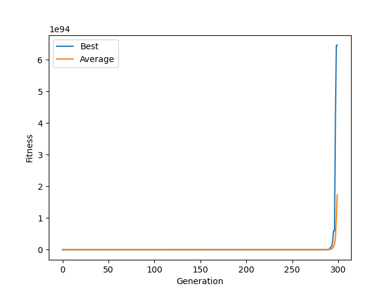

# Solving the XOR problem with Neuroevolution

---

## Problem

The XOR function works like:

```text
(0,0) → 0
(0,1) → 1
(1,0) → 1
(1,1) → 0
```

It is **not linearly separable**, so a hidden layer is required.

---

## Model

A small neural network:

```text
2 input neurons
2 hidden neurons
1 output neuron
```

* Activation: sigmoid
* Parameters evolved: weights + biases

Each candidate solution is a vector containing all network parameters.

---

## Genetic Algorithm

---

### Fitness

Fitness is based on prediction error:

```text
fitness = (1 / total_error)^k
```

where error is computed across all XOR inputs.

---

### Selection

* Tournament selection
* Strong elitism (best individual preserved)

---

### Mutation

* Random noise added to parameters


---

## Parameters

```text
Population size: 40
Generations: 300
Selection Group Size: 3
Architecture: 2-2-1
Mutation: additive noise
```

---

## Results

The algorithm evolves network parameters that approximate the XOR function.

Example output:

```text
(0,0) → ~0
(0,1) → ~1
(1,0) → ~1
(1,1) → ~0
```

---

### Fitness Behavior



The fitness curve looks like a **mirrored L** shape(im not sure about the official name of this curve) with long flat region at the beginning because of no good enough solution appears but suddenly when one appears, the fitness function being so agressive it astronomically increases the fitness of it. I did that because:

Since the problem space is very small (only 4 input cases), **highly aggressive fitness function** to amplify small improvements in error.

With **elitism**, this solution is preserved across generations, preventing regression.

---

## Notes

* Continuous fitness functions worked significantly better than categorical (correct/incorrect) scoring.
* Selection pressure had a major impact on convergence. Increasing it improved results but required tuning to remain stable.
* The problem can be solved with a 2-2-1 architecture, but because of the random nature of genetic algorithms, the model does not converge to a perfect XOR solution in every run. In most runs it learns the correct mapping, though occasional runs converge badly.

---

## Run

Install dependencies:

```text
pip install -r requirements.txt
```

Run:

```text
python main.py
```
